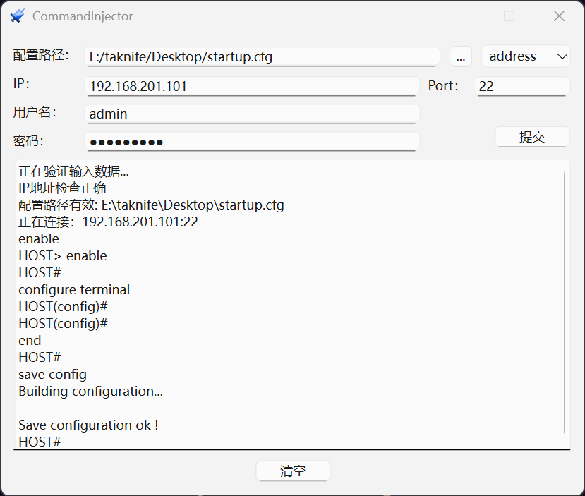

# CommandInjector
ABT设备命令执行工具，自动化刷入设备配置

## 支持平台

* Windows 10/11
* Linux/MacOS


## 部署方式

### Windows平台安装部署

* 直接下载发行版本[CommandInjector 发行版本](https://github.com/taknife/CommandInjector/releases)


### Linux/MacOS

* 下载源代码

    ```bash
    git clone https://github.com/taknife/CommandInjector.git
    ```

* 本地安装Python3.13 + 环境

* 创建Python项目，建议使用虚拟环境`venv`，通过`requirements.txt`安装依赖

    ```bash
    pip install -r requirements.txt
    ```

    如果安装很慢，安装报错，可以更换pip安装源，下文为清华源

    ```bash
    pip install -r requirements.txt -i https://pypi.tuna.tsinghua.edu.cn/simple
    ```

* 安装完成后，将源代码中的`src`、`images`、`ui`三个目录复制到项目中，运行`src/main.py`即可


## 使用方法

### 1. 写入.cfg配置文件

1. 确认配置下发终端与设备的网络连通性

    

2. 工具采用SSH协议进行连接，确认设备SSH端口，选择配置文件和需要提取的配置模块，填写IP、端口、用户名和密码点击提交。工具会自动检验填入参数是否合法，若没有问题，则执行写入操作。

    

    当出现save config时，完成保存配置的命令下发，此时可以在设备web页面进行查看，看是否下发成功。

### 2.写入.txt配置文件

1.   txt配置文件书写规则

     txt配置文件需要填写在标签`<[config_start]><[config_end]>`中

     工具只能识别到标签中间的配置文件内容，写在外面无法识别到有效配置文件。

     举例如下：

     

2.   完成配置文件书写后，打开命令导入工具，选择此文件。（可以发现配置模块处无法再选择，是因为自定义的txt配置文件不识别模块，直接导入全部配置）填写IP、端口、用户名和密码点击提交。工具会自动检验填入参数是否合法，若没有问题，则执行写入操作。

     

     当出现save config时，完成保存配置的命令下发，此时可以在设备web页面进行查看，看是否下发成功。
